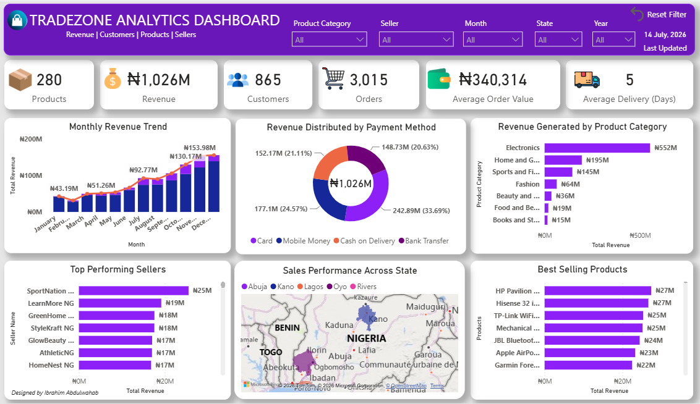

# 📊 TradeZone Sales Analytics Dashboard

## 📌 Project Overview

This project analyzes TradeZone's sales performance using SQL and Power BI. The objective is to uncover business insights from sales, customers, sellers, products, and regional performance to support data-driven decision-making.

---

## 🎯 Business Objectives

This project answers the following business questions:

- What is the total revenue generated?
- Which product categories generate the most revenue?
- Which Nigerian states contribute the highest sales?
- Who are the top-performing sellers?
- Which payment methods are most frequently used?
- How has revenue changed over time?

---

## 📂 Dataset

The dataset contains information about:

- Customers
- Orders
- Order Items
- Products
- Sellers
- Payments
- Reviews

---

## 🛠️ Tools Used

- PostgreSQL
- SQL
- Power BI
- DAX
- Power Query

---

## 📈 Dashboard Features

The dashboard includes:

- 📌 Total Revenue
- 👥 Total Customers
- 🛒 Total Orders
- 🚚 Average Delivery Days
- 📈 Revenue Trend
- 🛍 Revenue by Product Category
- 💳 Revenue by Payment Method
- 🏆 Top Selling Products
- ⭐ Top Performing Sellers
- 🗺 Revenue Distribution Across Nigeria
- 🎛 Interactive Filters & Slicers

---

## 📸 Dashboard Preview



---

## 💡 Key Insights

- Electronics generated the highest revenue.
- Lagos recorded the highest sales among all states.
- Card payments were the most preferred payment method.
- A small number of sellers generated a significant share of total revenue.
- Revenue fluctuated across different months, highlighting seasonal sales patterns.

---

## 📁 Repository Structure

```
TradeZone-Sales-Analytics
│
├── Dashboard
│   ├── TradeZone_Dashboard.pbix
│   └── Dashboard.png
│
├── Database
│   └── TradeZone_Databae.sql
│
├── Dataset
│   ├── customers.csv
│   ├── orders.csv
│   ├── order_items.csv
│   ├── payments.csv
│   ├── products.csv
│   ├── sellers.csv
│   └── reviews.csv
│
├── SQL
│   └── TradeZone_Analysis.sql
│
└── README.md
```

---

## 🚀 Skills Demonstrated

- SQL Query Writing
- Data Cleaning
- Data Modeling
- DAX Measures
- Dashboard Design
- Business Intelligence
- Data Visualization
- Interactive Reporting

---

## 👨‍💻 Author

**Ibrahim Abdulwahab**

**Data Analyst**

- 💼 LinkedIn: *(www.linkedin.com/in/abdulwahab-ibrahim-8b03641a7)*
- 💻 GitHub: *(https://github.com/abdulwahab-ibrahim)*

---

⭐ If you found this project interesting, feel free to star the repository or connect with me on LinkedIn.
